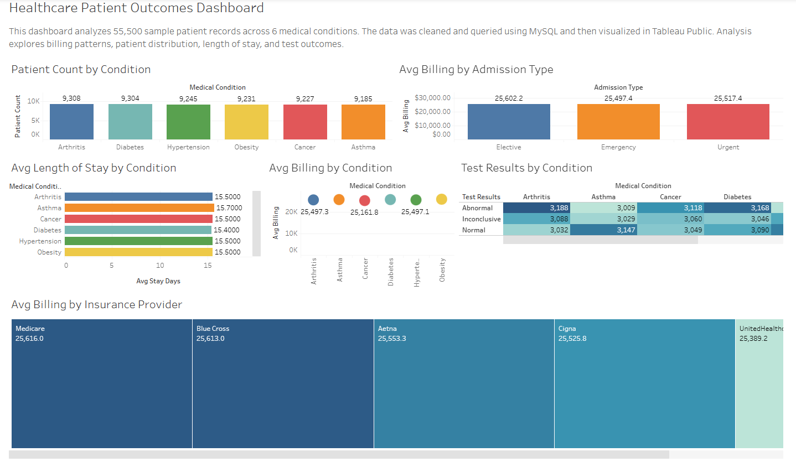

# Healthcare Patient Outcomes Analysis

## Overview
Analysis of 55,500 sample patient records across 6 medical conditions using MySQL and Tableau Public.

## Tools Used
- MySQL → data cleaning and querying
- Tableau Public → data visualization and dashboard

## Dataset
Synthetic healthcare dataset with 15 columns including patient demographics, medical conditions, billing amounts, admission types, and test results.

## SQL Process
- Imported and cleaned raw CSV data in MySQL
- Fixed inconsistent name casing using string functions
- Wrote 6 queries to analyze patient counts, billing patterns, length of stay, and test outcomes

## Dashboard
(https://public.tableau.com/views/HealthcarePatientOutcomesAnalysis/HealthcarePatientOutcomesDashboard?:language=en-US&:sid=&:redirect=auth&:display_count=n&:origin=viz_share_link)

## Key Analysis
- Patient distribution across 6 conditions: Arthritis, Asthma, 
  Cancer, Diabetes, Hypertension, Obesity
- Average billing by admission type (Elective, Emergency, Urgent)
- Average length of stay by condition
- Test result breakdown (Normal, Abnormal, Inconclusive) by condition
- Average billing by insurance provider
- Average billing by medical condition

## Notes
Dataset is entirely synthetic and used for demonstrating technical skills in SQL and Tableau.
